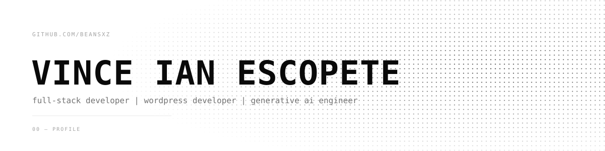

<picture>
  <source media="(prefers-color-scheme: dark)" srcset="./assets/banner-dark.svg">
  
</picture>

 
 

<picture>
  <source media="(prefers-color-scheme: dark)" srcset="https://readme-typing-svg.demolab.com/?font=JetBrains+Mono&size=14&duration=3000&pause=1200&color=A0A0A8&background=00000000&center=true&vCenter=true&width=600&height=30&lines=hi+there%2C+welcome+to+my+GitHub+profile!;learn%2C+code%2C+repeat.;passionate+with+building+something+new;web+development+%2B+ai+engineering;">
  
</picture>

 

  

### `01 — about`

Full-stack developer building digital experiences that make real-world ideas matter.

 

### `02 — tech stack`

— languages —

  
  
  
  
  
  
  
  

— frameworks/db —

  
  
  
  
  
  

— tools/ide —

  
  
  
  
  
  
  
  
  
  
  
  
  
  

 

### `03 — stats`

<picture>
  <source media="(prefers-color-scheme: dark)" srcset="https://streak-stats.demolab.com?user=beansxz&hide_border=true&background=0C0C0F&currStreakLabel=F4F4F5&sideLabels=F4F4F5&currStreakNum=F4F4F5&sideNums=F4F4F5&dates=A0A0A8&">
  
</picture>

<picture>
  <source media="(prefers-color-scheme: dark)" srcset="https://github-readme-stats-umber-kappa.vercel.app/api/top-langs/?username=beansxz&langs_count=10&card_width=540&layout=compact&hide_border=true&title_color=F4F4F5&text_color=A0A0A8&bg_color=0C0C0F">
  
</picture>

 

### `04 — connect`

  
  
  
  

 
 
 

<picture>
  <source media="(prefers-color-scheme: dark)" srcset="https://raw.githubusercontent.com/beansxz/beansxz/output/github-contribution-space-shooter-dark.svg">
  
</picture>